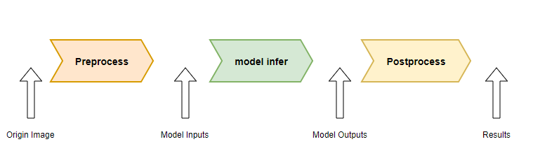
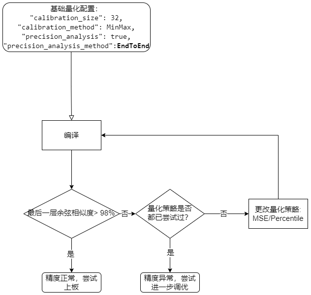
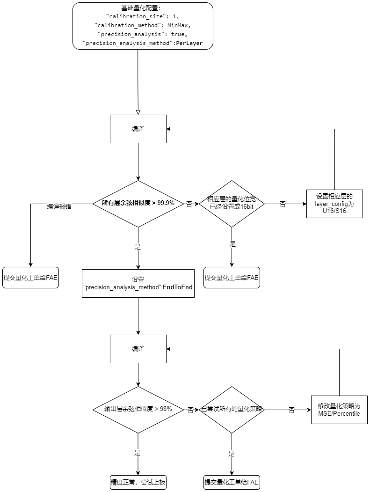

=========================================
精度调优建议
=========================================

-----------------------
基础问题排查
-----------------------

浮点模型量化后，不可避免的会有一定程度的精度损失，为了衡量精度损失情况，在编译阶段提供了一套量化精度分析工具，通过余弦相似度来判断量化前后模型的精度是否符合预期。
通常情况下，当模型最后的输出层 **余弦相似度 > 98%** 时，此时可以认为量化后的模型精度正常，可以进行部署的下一阶段。

.. note::

    需要注意的是，在编译阶段的量化精度分析工具的余弦相似度，并不等价于在测试数据集上的精度掉点情况(比如 ``AP`` ， ``mAP`` )。
    如果要掌握详细的数据集精度掉点情况，建议使用编译后的模型上板使用数据集测一遍模型精度。

本章节将会有一些基础的名词:

- **量化策略**：指使用何种策略统计浮点分布范围以获得量化参数，对应到配置中 ``quant`` 字段的 ``calibration_method`` 。

- **量化位宽**：指量化后，算子的输入输出位宽，可以通过 ``quant`` 字段的 ``layer_configs`` 进行配置。

在遇到精度问题时，先确认下列选项，再按照后面的章节进行精度调优：

- mean/std 与训练时一致：如果量化使用的数据集使用的格式为 ``Image`` ，请确保 ``quant`` 中的 ``input_configs`` 下的 ``calibration_mean`` 以及 ``calibration_std`` 与训练时一致。
- BGR与RGB格式：如果量化使用的数据集使用的格式为 ``Image`` ，请确保 ``input_processors`` 中的 ``tensor_layout`` 与训练时一致。
- 训练时Python的前后处理与板端运行时C++的前后处理确保对齐，对齐方式请参照 Q&A。
- 如果 ``csc_mode`` 设置成除 **YUYV422, UYVY422, YUV420SP, YVU420SP** 时，上板时测试精度时预处理建议使用 **IVE TDP做 resize** ，该预处理与Opencv 的 `bilinear` 插值方式对齐。
- 量化数据集是否正确:
  - 校准图片与使用场景尽量相同
  - 校准集数量是否场景足够丰富，应尽量覆盖所有类别

-----------------------
常见精度问题
-----------------------

~~~~~~~~~~~~~~~~~~~~~~~~
怎么设置模型为全U16?
~~~~~~~~~~~~~~~~~~~~~~~~

.. code-block:: shell

    {
       "layer_configs": [
           {
               "start_tensor_names": ["DEFAULT"], # string of list
               "end_tensor_names": ["DEFAULT"],   # string of list
               "data_type": "U16"
           }
         ]
     }

~~~~~~~~~~~~~~~~~~~~~~~~~~~~~~~~~~~~~~~~~~~~~~~~~~~~~~~~~~~~~~~~~~~~~~~~~~~~~~~~~~~~~~~~~~
为什么配置了 ``Add`` 算子量化位宽是 ``U16`` 在余弦相似度表里面看类型还是 ``U8``?
~~~~~~~~~~~~~~~~~~~~~~~~~~~~~~~~~~~~~~~~~~~~~~~~~~~~~~~~~~~~~~~~~~~~~~~~~~~~~~~~~~~~~~~~~~

- 工具链会先将输入的浮点模型做一次浮点图优化再进行量化，这时配置的算子名/算子类型可能没有出现在浮点图优化后的模型 ``optimized.onnx`` 里面，这时可以打开输出目录下的  ``output/frontend/optimized.onnx`` 查看该算子是否存在。
- 量化后模型的输出可能与输入类型不同，就会经常出现余弦相似度表格里的算子输出类型与配置不同，这是因为下一个算子的输入类型可能并没有配置为相同位宽，这时会将算子的输出类型设置成下个算子的输入类型，以提升推理性能。这种优化并不会影响精度。
- 如果是 ``Reshape / Transpose`` 等数据搬运类算子，设置该类算子的类型不会生效，它们的类型由下游的计算类算子类型决定。

~~~~~~~~~~~~~~~~~~
如何对齐前后处理？
~~~~~~~~~~~~~~~~~~

前后处理未对齐通常是影响上板精度的重要原因，为了排查前后处理的问题，我们建议按照如下步骤进行：

- 单个数据，使用训练时的Python端将 原始输入，预处理后的数据 ，模型输出，后处理后的数据 保存成bin文件；这里可以将结果进行可视化，以确保输出的正确性
- C++端测试预处理：读取上一步保存下来的原始数据，做为输入，得到 C++ 预处理后的结果，**与上一步保存的预处理后的数据进行比较，当两者误差在 0.0001 (1e-4) 以内时认为误差符合预期，即 (a - b) < 0.0001** 。
- C++端测试后处理：读取第一步保存下来的模型输出，做为模型输出，并计算后处理， 得到C++ 端处理后的结果，**与第一步保存的后处理后的数据进行比较，当两者误差在 0.001 (1e-3) 以内时认为误差符合预期。即 (a - b) < 0.001** 。

~~~~~~~~~~~~~~~~~~
outlier过大
~~~~~~~~~~~~~~~~~~

模型中出现如下的日志，说明模型中激活值存在较多的 ``outlier`` ，我们建议使用 ``smooth quant`` 功能来降低这些 ``outlier``。

.. code-block:: shell
    
                                            Ratio of outliers in tensor【 level=Log(Max_Pertensor/Max_Perchannel) 】
    ┏━━━━━━━━━━━━━━━━━━━━━━━━━━━━━━━━━━━┳━━━━━━━━━━━━━━━━━━━━━━┳━━━━━━━━━━━━━━━━━━━━┳━━━━━━━━━━━━━━━━━━━━━━━┳━━━━━━━━━━━━━━━━━━━━━━━┳━━━━━━━━━━━━━━━━━━━━━━━┓
    ┃ Op outputs                        ┃ Sparse channel ratio ┃ level>=3 ratio     ┃ level>=4 ratio        ┃ level>=5 ratio        ┃ level>=6 ratio        ┃
    ┡━━━━━━━━━━━━━━━━━━━━━━━━━━━━━━━━━━━╇━━━━━━━━━━━━━━━━━━━━━━╇━━━━━━━━━━━━━━━━━━━━╇━━━━━━━━━━━━━━━━━━━━━━━╇━━━━━━━━━━━━━━━━━━━━━━━╇━━━━━━━━━━━━━━━━━━━━━━━┩
    │ /vision_model/embeddings/patch_e… │ 0.0                  │ 0.6614583134651184 │ 0.3111979067325592    │ 0.00390625            │ 0.0                   │
    ├───────────────────────────────────┼──────────────────────┼────────────────────┼───────────────────────┼───────────────────────┼───────────────────────┤
    │ op_348:onnx.LayerNormalization_0… │ 0.0                  │ 0.921875           │ 0.5169270634651184    │ 0.1080729141831398    │ 0.0403645820915699    │
    ├───────────────────────────────────┼──────────────────────┼────────────────────┼───────────────────────┼───────────────────────┼───────────────────────┤
    │ op_396:onnx.LayerNormalization_0… │ 0.0                  │ 0.4427083432674408 │ 0.2473958283662796    │ 0.12109375            │ 0.0546875             │
    ├───────────────────────────────────┼──────────────────────┼────────────────────┼───────────────────────┼───────────────────────┼───────────────────────┤
    │ op_821:onnx.AxFullyConnected_q_0… │ 0.0                  │ 0.359375           │ 0.1875                │ 0.125                 │ 0.0625                │
    ├───────────────────────────────────┼──────────────────────┼────────────────────┼───────────────────────┼───────────────────────┼───────────────────────┤
    │ op_821:onnx.AxFullyConnected_k_0… │ 0.0                  │ 0.203125           │ 0.078125              │ 0.0625                │ 0.015625              │
    ├───────────────────────────────────┼──────────────────────┼────────────────────┼───────────────────────┼───────────────────────┼───────────────────────┤
    │ op_821:onnx.AxFullyConnected_v_0… │ 0.0                  │ 0.453125           │ 0.203125              │ 0.078125              │ 0.03125               │
    ├───────────────────────────────────┼──────────────────────┼────────────────────┼───────────────────────┼───────────────────────┼───────────────────────┤
    │ op_821:onnx.AxFullyConnected_q_1… │ 0.0                  │ 0.234375           │ 0.125                 │ 0.109375              │ 0.015625              │
    ├───────────────────────────────────┼──────────────────────┼────────────────────┼───────────────────────┼───────────────────────┼───────────────────────┤
    │ op_821:onnx.AxFullyConnected_k_1… │ 0.0                  │ 0.3125             │ 0.140625              │ 0.046875              │ 0.015625              │
    ├───────────────────────────────────┼──────────────────────┼────────────────────┼───────────────────────┼───────────────────────┼───────────────────────┤
    │ op_821:onnx.AxFullyConnected_v_1… │ 0.0                  │ 0.21875            │ 0.03125               │ 0.015625              │ 0.0                   │
    ├───────────────────────────────────┼──────────────────────┼────────────────────┼───────────────────────┼───────────────────────┼───────────────────────┤
    │ op_821:onnx.AxFullyConnected_q_2… │ 0.0                  │ 0.296875           │ 0.203125              │ 0.140625              │ 0.09375               │
    ├───────────────────────────────────┼──────────────────────┼────────────────────┼───────────────────────┼───────────────────────┼───────────────────────┤
    │ op_821:onnx.AxFullyConnected_k_2… │ 0.0                  │ 0.234375           │ 0.109375              │ 0.0625                │ 0.015625              │
    ├───────────────────────────────────┼──────────────────────┼────────────────────┼───────────────────────┼───────────────────────┼───────────────────────┤
    │ op_821:onnx.AxFullyConnected_v_2… │ 0.0                  │ 0.234375           │ 0.125                 │ 0.078125              │ 0.078125              │
    ├───────────────────────────────────┼──────────────────────┼────────────────────┼───────────────────────┼───────────────────────┼───────────────────────┤
    │ op_821:onnx.AxFullyConnected_q_3… │ 0.0                  │ 0.25               │ 0.09375               │ 0.078125              │ 0.03125               │
    ├───────────────────────────────────┼──────────────────────┼────────────────────┼───────────────────────┼───────────────────────┼───────────────────────┤
    │ op_821:onnx.AxFullyConnected_k_3… │ 0.0                  │ 0.1875             │ 0.109375              │ 0.03125               │ 0.015625              │
    ├───────────────────────────────────┼──────────────────────┼────────────────────┼───────────────────────┼───────────────────────┼───────────────────────┤
    │ op_821:onnx.AxFullyConnected_v_3… │ 0.0                  │ 0.296875           │ 0.15625               │ 0.0625                │ 0.0                   │
    ├───────────────────────────────────┼──────────────────────┼────────────────────┼───────────────────────┼───────────────────────┼───────────────────────┤
    │ op_821:onnx.AxFullyConnected_q_4… │ 0.0                  │ 0.234375           │ 0.171875              │ 0.0625                │ 0.046875              │
    ├───────────────────────────────────┼──────────────────────┼────────────────────┼───────────────────────┼───────────────────────┼───────────────────────┤
    │ op_821:onnx.AxFullyConnected_k_4… │ 0.0                  │ 0.359375           │ 0.203125              │ 0.09375               │ 0.046875              │

通过配置 ``quant`` 字段中的 ``enable_smooth_quant`` 可以使能该功能。

.. hint::

    该方法来源于论文  `SmoothQuant <https://arxiv.org/abs/2211.10438>`_

-----------------------
精度调优步骤
-----------------------

~~~~~~~~~~~~~~~~~~
更改量化策略
~~~~~~~~~~~~~~~~~~

通过更改量化策略来提升模型精度，目前可尝试的有 ``MSE`` ``Percentile`` ``MinMax`` ，对应 ``quant`` 字段中的 ``calibration_method`` 。

~~~~~~~~~~~~~~~~~~
混合精度调优设置
~~~~~~~~~~~~~~~~~~

如果更改量化策略之后余弦相似度还是较低，可以根据 ``Quant Precision Table 【PerLayer Reference】`` 中余弦相似度来调节量化位宽，具体流程如下图所示。

-----------------------
量化工单模板
-----------------------

请详细填写以下项，并提交给 FAE/AE。

- 其他平台经验
    - 是否有在其他平台部署过
    - 对应厂商、芯片型号、相应工具链版本 
    - 其他平台的量化脚本或者配置文件
    - 其他平台执行量化时的命令
    - 相应的数据集指标：浮点精度 / 板上运行时精度 / 精度指标
- 提供可复现的最小case：
    - onnx 浮点模型
    - onnx 浮点模型的单张图片测试用例，python 或者 C++ 都行
    - config.json 配置文件
    - 用于量化的最小数据集
    - Pulsar2 的编译命令
- 如因数据安全无法提供原始模型和数据集，则需要提供：
    - 提供随机权重的浮点模型
    - 完整的编译日志
    - 开启精度分析功能后 ( ``"precision_analysis": true, "precision_analysis_method" : "EndToEnd"`` )，将output/quant/debug 进行打包。
    - config.json 配置文件
    - 用于量化的最小数据集
    - Pulsar2 编译命令 