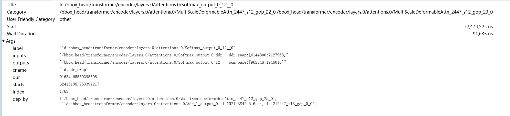
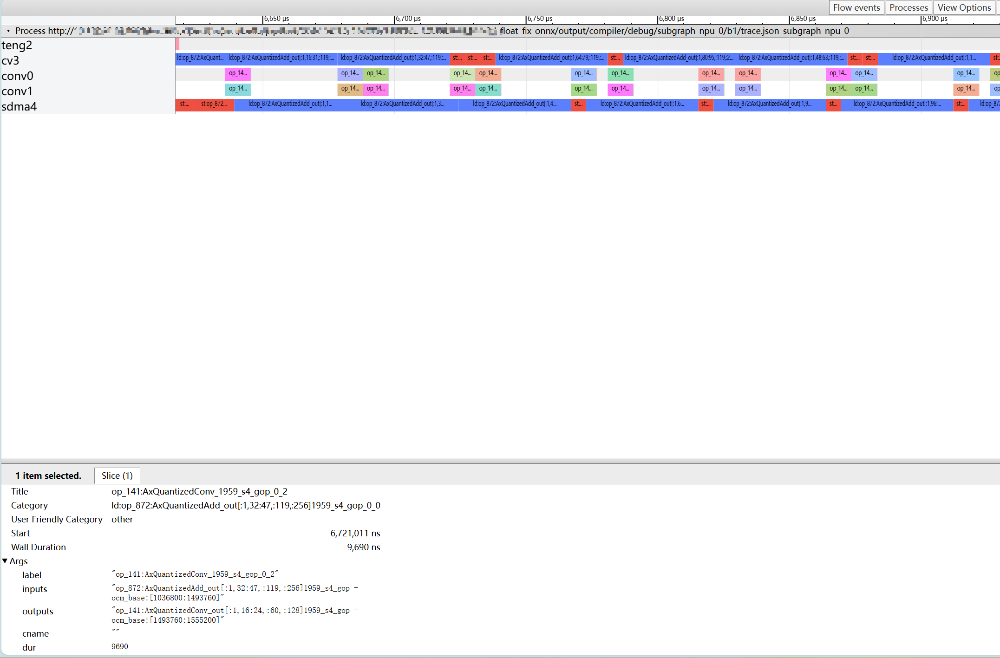
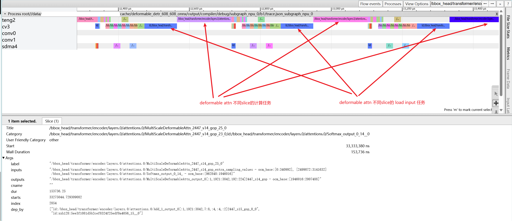

npu trace 工具使用说明
=======================

npu trace 简述
---------------

- npu 工具链编译过程中通过 task（NPU 硬件原子计算任务）间依赖关系和 cycle model 评估，模拟 npu 运行的推理性能分析工具
- 以 json 文件存储，包含 task 及其依赖信息，对齐上板推理时间。
- 对接离线通用的性能可视化分析工具 trace viewer (edge 浏览器地址栏输入 ``edge://tracing/`` 或 chrome 浏览器地址栏输入 ``chrome://tracing``) ，支持搜索功能

获取trace.json 文件
--------------------

- pulsar2 编译模型 ，增加编译选项 ``--compiler.npu_perf``，当工具链会将 trace 信息保存到 ``${output_dir}/compiler/debug/subgraph_npu_0/b1/trace.json``（其中 ``subgraph_npu_0`` 代表模型中的第一个 NPU 子图，``b1`` 代表默认 batch 或者 batch 1 的子图）
- tip : 增加编译选项 ``--debug.dump_frontend_graph``， 工具链会将前端优化后的计算图 dump 到 ``${output_dir}/frontend/optimzied_quant_axmodel.onnx``。trace 中可以根据 task 的 Title 内容关联到 ``optimzied_quant_axmodel.onnx`` 中的算子名，便于用户更好的理解硬件计算流和算法图的对应关系。

  - ``optimzied_quant_axmodel.onnx`` 为 onnx 格式，支持 Netron 工具打开，计算图中算子为工具链前端转换后的 AX 算子

trace 功能描述
---------------

trace 界面简述
~~~~~~~~~~~~~~~

.. figure:: ../media/tracing_interface.png
   :width: 690
   :height: 272

- trace.json 使用浏览器打开后，如上图所示

  - 工具栏：trace view 功能，可以通过 task label 检索 task 信息
  - trace 可视化区域：横轴为时间，纵轴为 npu IP。包含当前模型推理时间预估，不同 npu IP上的推理task展示
  - task 属性信息：在可视化区域点击具体 task，会在当前区域展示该task对应的详细信息

trace 可视化区域信息详述
~~~~~~~~~~~~~~~~~~~~~~~~~

- NPU IP 简述

  - teng：  tensor-engine vector处理单元，主要用于多通道并行数据加速处理。
  - sdma：simple dma，主要用于DDR和OCM间的数据搬运。
  - cv：主要用于数据整形、数据搬运。
  - conv：卷积神经网络计算IP，主要用于卷积运算。

- task 不同颜色对应的 task 信息含义

  - 红色：task 属性 cname **"st:ddr_swap"**
    - sdma/cv：将 OCM 数据换出到 ddr swap 区域
    - teng：将当前 task 的计算结果直接写出到 ddr swap 区域
  - 蓝色：task 属性 cname **"ld:ddr_swap"**
    - 将计算数据从 ddr 读取到 OCM
  - 明黄色：task 属性 cname **"ld:param"**
    - 将模型权重从 ddr 读取到 OCM
  - 绿色：task 属性 cname **"ld:input"**
    - 将模型 intput 读取到 OCM
  - 橙色：task 属性 cname **"st:output"**
    - 将模型 output 写出到 ddr
  - 其他：未指定颜色、cname 的 task，普通计算任务

task 属性区域信息详述
~~~~~~~~~~~~~~~~~~~~~~

- **Title** ：task 对应的 task label

  - 如上图所示，``ld:/bbox_head/transformer/encoder/layers.0/attentions.0/Softmax_output_0_12__0`` 包含三部分

    - task prefix： **"ld:"**
      
      - 与算子 label 以 **":"** 分隔。task 前缀一般常见：

        - ld: 该 task 包含 ddr 输入

        - st: 该 task 包含 ddr 输出

      - 普通计算任务，不包含 prefix

    - 算子 label： **"/bbox_head/transformer/encoder/layers.0/attentions.0/Softmax_output"**

      - 对应前端优化后的计算图<**frontend/optimzied_quant_axmodel.onnx**>上的算子 label，可以搜索到对应的算子信息

    - task postfix： **"_0_12__0"**

      - 算子 label 后 以 **"_[数字]"** 或 **"_s[数字]"** 如 **"_123_123 "** 或 **"_s123_gop_123"**

        - 通常为当前 task 在计算图中的 topo序 ID + 算子 tiler/slice 序号ID

        - 同一个算子需要切分成多个 task 时，增加后缀 用于该 task的唯一标识

- **Category** ：当前 task 依赖的 task 名称
  - "," 分隔表示依赖多个 job
- **Start** ：task 开始时间
- **Wall Duration** ：task 执行耗时
- **Args.label** ：同 **Title**
- **Args.inputs** ：task 输入 tensor names
  - **","** 分隔表示需要多输入
- **Args.outputs** ：task 输出 tensor names
- **Args.cname** ：task color name，对应不同的颜色标签，详见 **"trace 可视化区域信息详述"** 中的颜色描述
- **Args.dur** ：同 **Wall Duration**
- **Args.starts** ：同 **Start**
- **Args.dep_by** ： 依赖当前 task 的 task name

常见问题分析
-------------

ddr swap 过多引起的性能下降
~~~~~~~~~~~~~~~~~~~~~~~~~~~~

- 如上图所示，cv、sdma 上存在大量的 ld、st 的 ddr swap 任务，导致 conv 上计算任务不能连续执行，即为 ddr swap 过多引起的性能下降

算子非最优实现导致的性能瓶颈
~~~~~~~~~~~~~~~~~~~~~~~~~~~~~

- 如上图所示 conv 为空闲状态，cv、teng 处于串行状态，查看算子属性信息可以发现，算子 MultiScaleDeformableAttn 不同 slice 的 ld 和 comute 没有并行起来，说明该算子实现需要优化 slice 实现。或者在 onnx 上图手术，将该算子手动切分成更小的 slice，提升并行度
