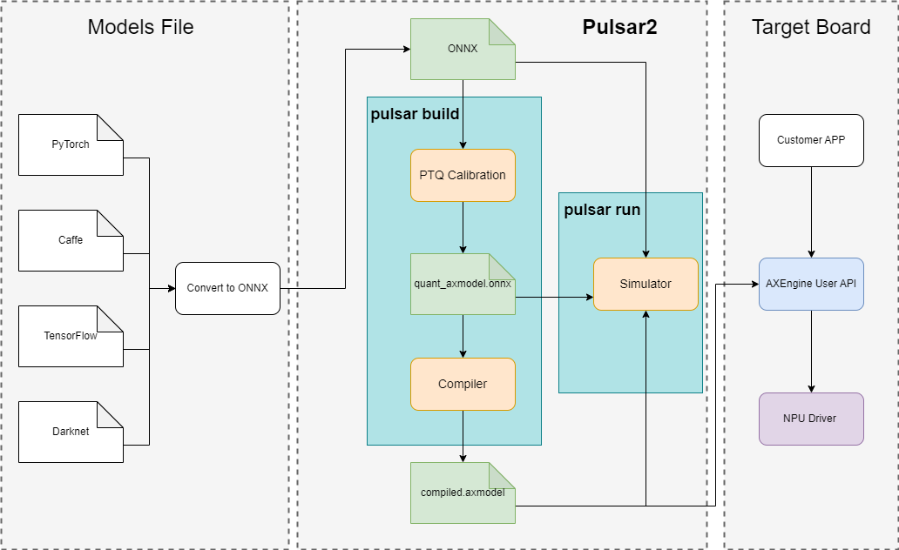
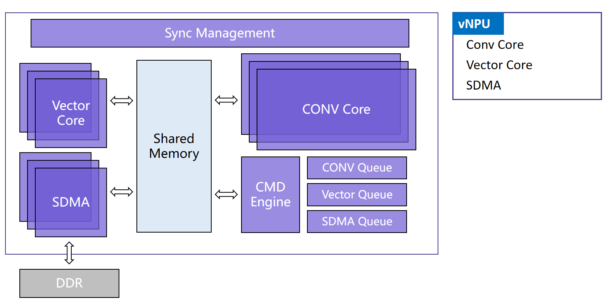
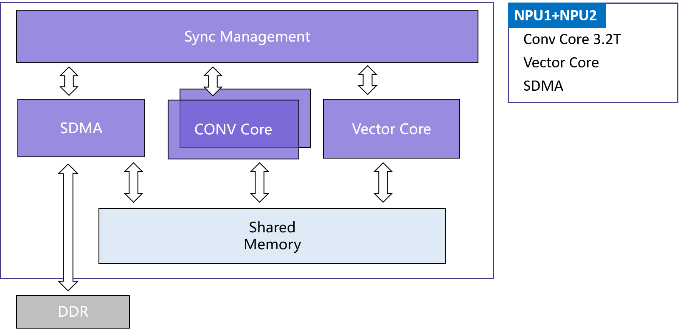

========================================
Pulsar2 工具链概述
========================================

----------------------------
简介
----------------------------

**Pulsar2** 由 `爱芯元智 <https://www.axera-tech.com/>`_ **自主研发** 的 ``all-in-one`` 新一代神经网络编译器, 
即 **转换**、 **量化**、 **编译**、 **异构** 四合一, 实现深度学习神经网络模型 **快速**、 **高效** 的部署需求. 
针对新一代 `AX6、M7` 系列芯片（AX630C、AX620AV200、AX620Q、AX650A、AX650N、M76H）特性进行了深度定制优化, 充分发挥片上异构计算单元(CPU+NPU)算力, 提升神经网络模型的产品部署效率.

**特别说明：**

- 工具链文档中的命令兼容车载芯片，例如 ``Pulsar2`` 支持 ``M76H``
- 工具链文档中的 **示例命令**、 **示例输出** 均基于 ``AX650`` 进行展示
- 具体芯片的算力配置，以芯片SPEC为准

``Pulsar2`` 工具链核心功能是将 ``.onnx`` 模型编译成芯片能解析并运行的 ``.axmodel`` 模型.

**部署流程**

.. _soc_introduction:

----------------------------
虚拟 NPU 介绍
----------------------------

**AX650 和 M76H NPU** 主要由 **3** 个 Conv 卷积计算核，3 组向量 Vector 计算核组成。这些 Conv 和 Vector 计算核按照 1:1 的比例分配，划分为 **3 组 vNPU**。

- 在运行时，通过 **AXEngine API** 可以设置 NPU 的工作模式，灵活的对 vNPU 进行分组，可以设置为 1 + 1 + 1 的三个对称 vNPU 模式，或者 2 + 1 的大小 vNPU 模式，也可以设置为 3 的大算力单 vNPU 模式。

- 在转换模型时，可以根据需求灵活的指定模型推理所需的 vNPU 数量（详细信息请查看 ``pulsar2 build`` 的 ``--npu_mode 参数``）。当模型部署到芯片平台上加载时，AXEngine 可以根据当前设置的 NPU 工作模式将模型分配到对应算力的 vNPU 之上运行。

**AX630C、AX620AV200、AX620Q** 采用双核 NPU 设计，根据 AI-ISP 是否启用划分成两种工况分配给用户不同算力。

- 在转换模型时，需根据实际业务中 AI-ISP 的工况显式配置用户模型的 NPU 工作模式（详细信息请查看 ``pulsar2 build`` 的 ``--npu_mode 参数``）。
- AX630C、AX620AV200、AX620Q 中的 NPU 模块均采用爱芯元智 **通元4.0** NPU 引擎，后续章节使用 ``AX620E`` 简化目标硬件平台指定。
