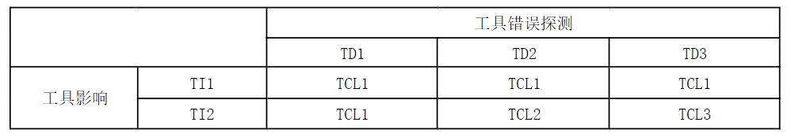
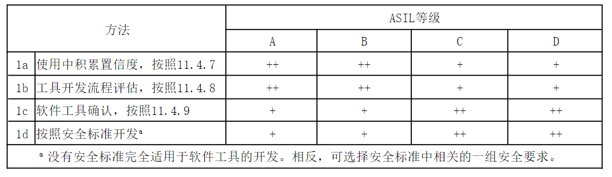

.. _tool_classification:

=========
功能安全
=========

**工具分类**

依据ISO-26262 Part8，在安全相关的使用场景中, Pulsar2的异常会引入产品安全要素的错误（TI2），并且对异常和错误的预防和探测置信度较低（TD3）。因此Pulsar2的置信度水平评估为 TCL3。

	
具体分析参见“Pulsar2 软件工具置信度评估报告 Pulsar2 Software Tool Confidence Evaluation Report”

**功能安全符合性**

Pulsar2的软件工具的鉴定主要通过“1c软件工具确认”的方法。基于测试套件的测试覆盖了完整的工具需求同时提供了工具错误不会发生或将被检测到的证据。针对软件工具功能异常也有相应的处理手册。此外, Pulsar2 已使用超过2年, 并在多个客户项目中使用。
同时，Pulsar2成功通过了第三方权威认证机构的功能安全认证。
因此, 在遵循用户手册时, Pulsar2 可用于开发安全要求最高为ASIL-D的的模型。

相关文档：

“Pulsar2 工具集成测试报告 Pulsar2 Software Tool Integration Test Report”

“Pulsar2 软件工具鉴定报告 Pulsar2 Software Tool Qualification Report”

“Pulsar2 软件工具异常处理手册 Pulsar2 Software Tool Exception Handling”