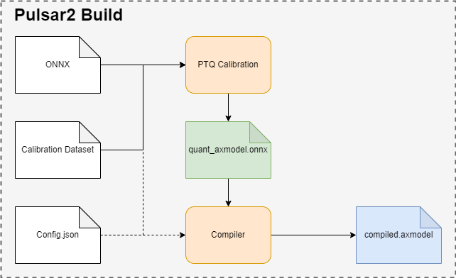
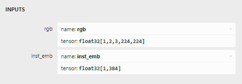
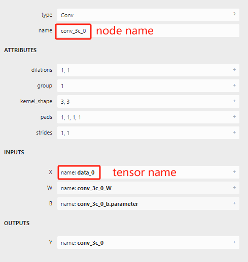
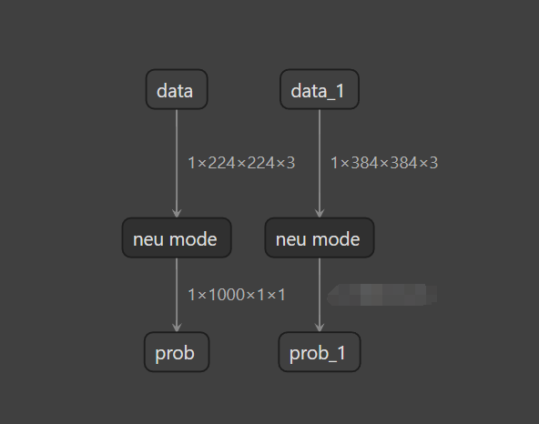

===================
模型转换进阶指南
===================

-----------------------
概述
-----------------------

``pulsar2 build`` 用于模型 **图优化**、 **量化**、 **编译** 等操作. 其运行示意图如下: 

* ``pulsar2 build`` 利用输入模型(``model.onnx``)、PTQ校准数据(``calibration.tar``)和配置文件(``config.json``), 生成输出模型(``axmodel``). 
* ``pulsar2 build`` 的命令行参数将会覆盖配置文件中的某些对应部分, 并使 ``pulsar2 build`` 将覆盖过后得到的配置文件输出出来. 配置文件的详细介绍参见 :ref:`《配置文件详细说明》 <config_details>`. 

-----------------------
模型编译详解
-----------------------

本节介绍 ``pulsar2 build`` 命令完整使用方法. 

``pulsar2 build -h`` 可显示详细命令行参数: 

.. code-block:: shell
  :name: pulsar_build_help
  :linenos:

    usage: main.py build [-h] [--config] [--input] [--output_dir] [--output_name]
                          [--work_dir] [--model_type] [--target_hardware]
                          [--npu_mode] [--input_shapes]
                          [--onnx_opt.disable_onnx_optimization]
                          [--onnx_opt.enable_onnxsim] [--onnx_opt.model_check]
                          [--onnx_opt.disable_transformation_check]
                          [--onnx_opt.save_tensors_data]
                          [--quant.calibration_method] [--quant.precision_analysis]
                          [--quant.precision_analysis_method]
                          [--quant.precision_analysis_mode]
                          [--quant.highest_mix_precision]
                          [--quant.conv_bias_data_type]
                          [--quant.refine_weight_threshold]
                          [--quant.enable_smooth_quant]
                          [--quant.transformer_opt_level]
                          [--quant.input_sample_dir] [--quant.ln_scale_data_type]
                          [--quant.check] [--quant.disable_auto_refine_scale]
                          [--compiler.static_batch_sizes [...]]
                          [--compiler.max_dynamic_batch_size]
                          [--compiler.disable_ir_fix] [--compiler.check]
                          [--compiler.check_mode] [--compiler.debug]
                          [--compiler.input_sample_dir]
     optional arguments:
       -h, --help            show this help message and exit
       --config              config file path, supported formats: json / yaml /
                             toml / prototxt. type: string. required: false.
                             default:.
       --input               input model file path. type: string. required: true.
       --output_dir          axmodel output directory. type: string. required:
                             true.
       --output_name         rename output axmodel. type: string. required: false.
                             default: compiled.axmodel.
       --work_dir            temporary data output directory. type: string.
                             required: false. default: same with ${output_dir}.
       --model_type          input model type. type: enum. required: false.
                             default: ONNX. option: ONNX, QuantAxModel, QuantONNX.
       --target_hardware     target hardware. type: enum. required: false. default:
                             AX650. option: AX650, AX620E, M76H.
       --npu_mode            npu mode. while ${target_hardware} is AX650, npu mode
                             can be NPU1 / NPU2 / NPU3. while ${target_hardware} is
                             AX620E, npu mode can be NPU1 / NPU2. type: enum.
                             required: false. default: NPU1.
       --input_shapes        modify model input shape of input model, this feature
                             will take effect before the `input_processors`
                             configuration. format:
                             input1:1x3x224x224;input2:1x1x112x112. type: string.
                             required: false. default: .
       --onnx_opt.disable_onnx_optimization 
                             disable onnx optimization. type: bool. required:
                             false. default: false.
       --onnx_opt.enable_onnxsim 
                             enable onnx simplify by
                             https://github.com/daquexian/onnx-simplifier. type:
                             bool. required: false. default: false.
       --onnx_opt.model_check 
                             enable model check. type: bool. required: false.
                             default: false.
       --onnx_opt.disable_transformation_check 
                             disable transformation check. type: bool. required:
                             false. default: false.
       --onnx_opt.save_tensors_data 
                             save tensors data to optimize memory footprint. type:
                             bool. required: false. default: false.
       --quant.calibration_method 
                             quantize calibration method. type: enum. required:
                             false. default: MinMax. option: MinMax, Percentile,
                             MSE.
       --quant.precision_analysis 
                             enable quantization precision analysis. type: bool.
                             required: false. default: false.
       --quant.precision_analysis_method 
                             precision analysis method. type: enum. required:
                             false. default: PerLayer. option: PerLayer, EndToEnd.
       --quant.precision_analysis_mode 
                             precision analysis mode. type: enum. required: false.
                             default: Reference. option: Reference, NPUBackend.
       --quant.highest_mix_precision 
                             enable highest mix precision quantization. type: bool.
                             required: false. default: false.
       --quant.conv_bias_data_type 
                             conv bias data type. type: enum. required: false.
                             default: S32. option: S32, FP32.
       --quant.refine_weight_threshold 
                             refine weight threshold, should be a legal float
                             number, like 1e-6. -1 means disable this feature.
                             type: float. required: false. default: 1e-6.
                             limitation: 0 or less than 0.0001.
       --quant.enable_smooth_quant 
                             enalbe smooth quant strategy for conv 1x1. type: bool.
                             required: false. default: false.
       --quant.transformer_opt_level 
                             tranformer opt level. type: int. required: false.
                             default: 0. limitation: 0~2.
       --quant.input_sample_dir 
                             input sample data dir for precision analysis. type:
                             string. required: false. default: .
       --quant.ln_scale_data_type 
                             LayerNormalization scale data type. type: enum.
                             required: false. default: FP32. option: FP32, S32,
                             U32.
       --quant.check         quant check level, 0: no check; 1: check node dtype.
                             type: int. required: false. default: 0.
       --quant.disable_auto_refine_scale 
                             refine weight scale and input scale, type: bool.
                             required: false. default: false.
       --compiler.static_batch_sizes [ ...]
                             static batch sizes. type: int array. required: false.
                             default: [].
       --compiler.max_dynamic_batch_size 
                             max dynamic batch. type: int, required: false.
                             default: 0.
       --compiler.disable_ir_fix 
                             disable ir fix, only work in multi-batch compilation.
                             type: bool. required: false. default: false.
       --compiler.check      compiler check level, 0: no check; 1: assert all close; 
                             2: assert all equal. type: int. required: false. 
                             default: 0.
       --compiler.check_mode 
                             compiler check mode, CheckOutput: only check model
                             output; CheckPerLayer: check model intermediate tensor
                             and output. type: enum. required: false. default:
                             CheckOutput. option: CheckOutput, CheckPerLayer.
       --compiler.debug      compiler debug level. type: int. required: false.
                             default: 0.
       --compiler.input_sample_dir 
                             input sample data dir for compiler check. type:
                             string. required: false. default: .

.. hint::

    - 用户可以根据参数规格编写 ``json / yaml / toml / prototxt`` 格式的配置文件，通过命令行参数 ``--config`` 指向配置文件
    - 部分编译参数支持命令行传入，且优先级高于配置文件，通过 ``pulsar2 build -h`` 查看支持的命令行编译参数，比如命令行参数 ``--quant.calibration_method`` 相当于配置了 ``QuantConfig`` 结构体的 ``calibration_method`` 字段

~~~~~~~~~~~~~~~~
参数详解
~~~~~~~~~~~~~~~~

.. data:: pulsar2 build 参数解释

    --config

        - 数据类型：string
        - 是否必选：是
        - 描述：配置文件路径，支持 ``json / yaml / toml / prototxt``  格式，结构体见 :ref:`《配置文件详细说明》 <config_details>`

    --work_dir

        - 数据类型：string
        - 是否必选：否
        - 默认值：与 output_dir 相同
        - 描述：中间结果输出目录

    --input

        - 数据类型：string
        - 是否必选：是
        - 描述：输入模型路径

    --output_dir

        - 数据类型：string
        - 是否必选：是
        - 描述：编译结果输出目录，编译后的模型命名为 compiled.axmodel

    --model_type

        - 数据类型：enum
        - 是否必选：否
        - 默认值：ONNX
        - 描述：输入模型类型，支持枚举: ``ONNX``, ``QuantAxModel``, ``QuantONNX``

    --target_hardware

        - 数据类型：enum
        - 是否必选：否
        - 默认值：AX650
        - 描述：模型编译的目标 soc 平台类型，支持 ``AX650``, ``AX620E``, ``M76H``

    --npu_mode

        - 数据类型：enum
        - 是否必选：否
        - 默认值：NPU1
        - 描述：模型编译模式

            * soc 平台为 ``AX650`` 时，支持枚举: ``NPU1``, ``NPU2``, ``NPU3``
            * soc 平台为 ``AX620E`` 时，支持枚举: ``NPU1``, ``NPU2``

      .. warning:: npu_mode 指的是使用的 NPU 核数，而不是 vNPU 编号，请不要混淆。

    --input_shapes

        - 数据类型：string
        - 是否必选：否
        - 默认值：空
        - 描述：模型编译过程中，修改模型的输入尺寸，格式为：``input1:1x3x224x224;input2:1x1x112x112``。

    --onnx_opt

        - disable_onnx_optimization

            - 数据类型：bool
            - 是否必选：否
            - 默认值：false
            - 描述：是否使能浮点 ONNX 模型图优化模块。

        - enable_onnxsim

            - 数据类型：bool
            - 是否必选：否
            - 默认值：false
            - 描述：是否使用 `onnxsim` 工具简化浮点 ONNX，https://github.com/daquexian/onnx-simplifier。

        - model_check

            - 数据类型：bool
            - 是否必选：否
            - 默认值：false
            - 描述：是否使能浮点 ONNX 模型图优化结束后与原始 ONNX 模型的对分功能。

        - disable_transformation_check

            - 数据类型：bool
            - 是否必选：否
            - 默认值：false
            - 描述：在浮点 ONNX 模型图优化过程中，是否禁用每次子图变换后的子图对分功能。

    --quant

        在 BuildConfig 中是名为 quant 的成员变量

        - calibration_method

            - 数据类型：enum
            - 是否必选：否
            - 默认值：MinMax
            - 描述：量化算法，支持的枚举 ``MinMax``， ``Percentile``， ``MSE``，  结构体见 :ref:`《配置文件详细说明》 <config_details>`

        - precision_analysis

            - 数据类型：bool
            - 是否必选：否
            - 默认值：false
            - 描述：是否逐层分析 Quant AXModel 的量化精度

        - precision_analysis_method

            - 数据类型：enum
            - 是否必选：否
            - 默认值：PerLayer
            - 描述：精度分析方法，可选 PerLayer / EndToEnd。PerLayer 意味着每一层都采用浮点模型对应的层输入，计算每一层的输出与浮点模型输出的相似度。EndToEnd 代表首层采用浮点模型输入，然后进行完整模型的仿真，计算最终输出结果与浮点模型输出的相似度。

        - precision_analysis_mode

            - 数据类型：enum
            - 是否必选：否
            - 默认值：Reference
            - 描述：逐层仿真的实现，可选 Reference / NPUBackend。Reference 可以运行编译器支持的全部模型（支持包含 CPU 及 NPU 子图的模型），但是计算结果相比于最终上板结果会有少量误差（基本上差距在正负 1 内，且无系统性误差）。NPUBackend 可以运行仅包含 NPU 子图的模型，但是计算结果与上板结果比特对齐。

        - highest_mix_precision

            - 数据类型：bool
            - 是否必选：否
            - 默认值：false
            - 描述：是否使能最高精度量化模式。

        - conv_bias_data_type

            - 数据类型：enum
            - 是否必选：否
            - 默认值：S32
            - 描述：量化时 Conv 算子 Bias 属性保存的数据类型，可选 S32 / FP32。

        - refine_weight_threshold

            - 数据类型：float
            - 是否必选：否
            - 默认值：1e-6
            - 描述：将权重量化阈值调整至指定值。

        - enable_smooth_quant

            - 数据类型：bool
            - 是否必选：否
            - 默认值：false
            - 描述：使能 smooth quant 量化策略以提升量化精度。

        - transformer_opt_level

            - 数据类型：int
            - 是否必选：否
            - 默认值：0
            - 描述：Transformer 网络的量化方式配置。

        - input_sample_dir

            - 数据类型：string
            - 是否必选：否
            - 默认值：空
            - 描述：配置用于量化精度分析的输入数据目录，如果未指定，则采用量化校准集中的数据。

            .. note::

                注意 ``--quant.input_sample_dir`` 中的输入数据的格式应与原模型相同。

    --compiler

        在 BuildConfig 中是名为 compiler 的成员变量

        - static_batch_sizes

            - 数据类型：list of int
            - 是否必选：否
            - 默认值：0
            - 描述：编译器按照用户提供 batch 组合进行编译，基于这一组 batch 模型，可以在运行时支持任意 batch_size 输入的高效推理。详情参考：:ref:`《静态多 batch 模式》 <multi_batch_static_compile>`。

        - max_dynamic_batch_size

            - 数据类型：int
            - 是否必选：否
            - 默认值：0
            - 描述：编译器自动推导出 NPU 可高效运行且不大于 max_dynamic_batch_size 的 batch 模型组合，基于这一组 batch 模型，可以在运行时支持任意 batch_size 输入的高效推理。详情参考：:ref:`《动态多 batch 模式》 <multi_batch_dynamic_compile>`。

        - disable_ir_fix

            - 数据类型：bool
            - 是否必选：否
            - 默认值：false
            - 描述：多 batch 编译时，是否禁止编译器默认的 Reshape 算子属性修改行为。

        - check

            - 数据类型：int
            - 是否必选：否
            - 默认值：0
            - 描述：是否通过仿真检查编译结果的正确性，0 代表不做任何检查；1 代表 all close 检查；2 代表 all equal 检查。

        - check_mode

            - 数据类型：enum
            - 是否必选：否
            - 默认值：0
            - 描述：对分模式，CheckOutput 代表只对结果进行对分。CheckPerLayer 代表逐层对分。

        - input_sample_dir

            - 数据类型：string
            - 是否必选：否
            - 默认值：空
            - 描述：配置用于编译器检查的输入数据目录，如果未指定，则会优先使用量化校准数据。

            .. note::

                注意 ``--compiler.input_sample_dir`` 中的输入数据的格式应与编译后的模型相同（包含预处理）。

------------------------------------
多核编译详解
------------------------------------

用户可通过修改 ``pulsar2 build`` 中的 ``--npu_mode`` 选项灵活配置 **NPU编译模式**，充分利用算力。

~~~~~~~~~~~~~~~~~~~~~~~~~~~~~~
NPU 单核模式
~~~~~~~~~~~~~~~~~~~~~~~~~~~~~~

``--npu_mode`` 默认配置是 ``NPU1``，即 ``1 个 NPU core`` 模式。之前的 :ref:`《模型编译》 <model_compile>` 章节中均采用 ``NPU1`` 默认配置进行说明。

~~~~~~~~~~~~~~~~~~~~~~~~~~~~~~
NPU 双核模式
~~~~~~~~~~~~~~~~~~~~~~~~~~~~~~

``--npu_mode`` 配置修改为 ``NPU2``，即 ``2 个 NPU core`` 模式。以转换 ``mobilenetv2`` 模型举例，修改配置文件如下所示：

.. code-block::

    {
      "model_type": "ONNX",
      "npu_mode": "NPU2",   # 只需要修改这里，默认配置是 NPU1
      "quant": {
        "input_configs": [
          {
            "tensor_name": "input",
            "calibration_dataset": "./dataset/imagenet-32-images.tar",
            "calibration_size": 32,
            "calibration_mean": [103.939, 116.779, 123.68],
            "calibration_std": [58.0, 58.0, 58.0]
          }
        ],
        "calibration_method": "MinMax",
        "precision_analysis": false
      },
      "input_processors": [
        {
          "tensor_name": "input",
          "tensor_format": "BGR",
          "src_format": "BGR",
          "src_dtype": "U8",
          "src_layout": "NHWC",
          "csc_mode": "NoCSC"
        }
      ],
      "compiler": {
        "check": 0
      }
    }

``pulsar2 build`` 编译命令如下：

.. code-block::

    root@xxx:/data# pulsar2 build --input model/mobilenetv2-sim.onnx --output_dir output --config config/mobilenet_v2_build_config.json

.. _multi_batch_compile:

------------------------------------
多 batch 编译详解
------------------------------------

``pulsar2 build`` 支持用户配置模型的 batch_size，分为静态多 batch 及动态多 batch 编译两种模式，这两种模式互斥。本章节以 ``AX650`` 举例。

.. _multi_batch_static_compile:

~~~~~~~~~~~~~~~~~~~~~~~~~~~~~~
静态多 batch 模式
~~~~~~~~~~~~~~~~~~~~~~~~~~~~~~

编译器按照用户提供 batch 组合进行编译，支持命令行参数 ``--compiler.static_batch_sizes`` 配置以及修改配置文件中的 ``compiler.static_batch_sizes`` 两种方式。

* 设置静态多 batch 编译后，通过 ``onnx inspect -m -n -t`` 查看 ``compiled.axmodel`` 时，输入输出 shape 的 batch 维将变为用户指定的最大 batch。

    * **batch 之间将尽可能的复用权重数据**，因此模型大小相比于单独编译各个 batch 的模型大小总和更小。

.. hint::

   以 mobilenetv2 模型为例，原模型输入 ``input`` shape 为 ``[1, 224, 224, 3]``，
   进行 ``static_batch_sizes`` 等于 [1, 2, 4] 的静态多 batch 编译后，shape 将变为 ``[4, 224, 224, 3]``。

.. _multi_batch_dynamic_compile:

~~~~~~~~~~~~~~~~~~~~~~~~~~~~~~
动态多 batch 模式
~~~~~~~~~~~~~~~~~~~~~~~~~~~~~~

编译器自动推导出 NPU 可高效运行且不大于 ``max_dynamic_batch_size`` 的 batch 模型组合，基于这一组 batch 模型，可以在运行时支持任意 batch_size 输入的高效推理。支持命令行参数 ``--compiler.max_dynamic_batch_size`` 配置以及修改配置文件中的 ``compiler.max_dynamic_batch_size`` 两种方式。

* 编译器会从 batch 1 开始，2 倍递增进行编译，当 batch 大于设置的 ``max_dynamic_batch_size`` 或者当前 batch 理论推理效率低于前一个 batch 时停止。

    * batch 理论推理效率：理论推理耗时 / batch_size。

    * **batch 之间将尽可能的复用权重数据**，因此模型大小相比于单独编译各个 batch 的模型大小总和更小。

* 设置动态多 batch 编译后，通过 ``onnx inspect -m -n -t`` 查看 ``compiled.axmodel`` 时，输入输出 shape 的 batch 维将变为 ``max_dynamic_batch_size``。

.. hint::

    以 mobilenetv2 模型为例，原模型输入 ``input`` shape 为 ``[1, 224, 224, 3]``，
    进行 ``max_dynamic_batch_size`` 等于 4 的动态多 batch 编译后，shape 将变为 ``[4, 224, 224, 3]``。

* 运行时，会根据调用者在推理时设置的动态 batch 大小，寻找合适的 batch 组合，进行多次推理。

.. hint::

    当一个模型理论推理效率随着 batch 数增加而提高并且编译后仅有一个 NPU 子图，``max_dynamic_batch_size`` 设置为 4 时，编译后的 ``compiled.axmodel`` 中会包含 [1, 2, 4] 三个 batch 的模型。

    推理或仿真时：

    * 如果设置动态 batch 的值为 3 时，``axengine 推理框架`` 及 ``pulsar2 run 仿真器`` 会在内部进行 batch 2 + batch 1 两次 NPU 推理或仿真。
    * 如果设置动态 batch 的值为 9 时，``axengine 推理框架`` 及 ``pulsar2 run 仿真器`` 会在内部进行 batch 4 + batch 4 + batch 1 三次 NPU 推理或仿真。
  
动态多 batch 编译时，会有以下日志展示出编译出的 batch 组合：

.. code-block:: bash

    ...
    2023-07-09 20:06:02.690 | INFO     | yamain.command.build:compile_npu_subgraph:985 - QuantAxModel macs: 280,262,480
    2023-07-09 20:06:06.786 | WARNING  | yamain.command.build:compile_npu_subgraph:1035 - graph [subgraph_npu_0] batchs [1, 2]
    2023-07-09 20:06:06.795 | INFO     | yamain.command.build:compile_ptq_model:924 - fuse 1 subgraph(s)

~~~~~~~~~~~~~~~~~~~~~~~~~~~~~~~~~~~~~~~~~~~~
包含 Reshape 算子的模型多 batch 编译
~~~~~~~~~~~~~~~~~~~~~~~~~~~~~~~~~~~~~~~~~~~~

如果模型中包含 ``Reshape`` 算子，在执行多 batch 编译时 ``pulsar2`` 可能无法正确的推测出 ``Reshape`` 算子的输出 shape。

此时用户可以通过 :ref:`《常量数据修改》 <const_patch>` 功能，修改 ``Reshape`` 算子的 ``shape`` 输入数据，使得 ``pulsar2`` 在多 batch 编译过程中正确推导出输出 shape。

比如存在一个 shape 为 ``[2, 1, 64]`` 的 ``Reshape`` 算子，假设第 1 维为 batch，则通过常量数据修改功能，将 shape 对应的常量 tensor 修改为 ``[2, -1, 64]`` 或者 ``[2, 0, 64]`` 后，即可支持多 batch 编译。

除此之外，如果用户没有显式的配置算子属性修改，那么 ``pulsar2`` 会将 ``Reshape`` 算子 **shape 的第 0 维修改为 -1，尝试进行多 batch 编译**。

.. hint::

    pulsar2 支持在 ``Reshape`` 的 shape 中配置 ``0`` 或者 ``-1``。``0`` 代表与输入 tensor 对应维度的值相同；``-1`` 代表根据输入 tensor 计算得出的未知维度大小。

.. _perlayer_precision_debug:

------------------------------------
逐层对分详解
------------------------------------

``pulsar2 build`` 提供了一套浮点模型与量化后模型的逐层精度对比工具。有如下两种方式配置，任选其一即可：

* 在命令行中配置 ``--quant.precision_analysis 1`` 开启精度对比功能；如下为一个示例：

.. code-block:: bash

    root@xxx:/data/quick_start_example# pulsar2 build --input model/mobilenetv2-sim.onnx --output_dir output --config config/config_mobilenet_v2_onnx.json --quant.precision_analysis 1 

* 编译命令不变，在配置文件中将 ``"precision_analysis": false`` 修改为 ``"precision_analysis": true``：

.. code-block:: bash

    {
      "model_type": "ONNX",
      "npu_mode": "NPU1",
      "quant": {
        "input_configs": [
          {
            "tensor_name": "input",
            "calibration_dataset": "./dataset/imagenet-32-images.tar",
            "calibration_size": 32,
            "calibration_mean": [103.939, 116.779, 123.68],
            "calibration_std": [58.0, 58.0, 58.0]
          }
        ],
        "calibration_method": "MinMax",
        "precision_analysis": true  # 这里修改为 true, 默认是 false
      },
      "input_processors": [
        {
          "tensor_name": "input",
          "tensor_format": "BGR",
          "src_format": "BGR",
          "src_dtype": "U8",
          "src_layout": "NHWC",
          "csc_mode": "NoCSC"
        }
      ],
      "compiler": {
        "check": 0
      }
    }

重新执行编译过程后，可得到如下带有 ``Quant Precision Table`` 的输出信息，包含了 **节点名、类型、输出名、数据类型、输出形状、余弦相似度** 等：

.. code-block:: bash

    root@xxx:/data# pulsar2 build --input model/mobilenetv2-sim.onnx --output_dir output --config config/mobilenet_v2_build_config.json
    ...
    Building native ━━━━━━━━━━━━━━━━━━━━━━━━━━━━━━━━━━━━━━━━ 100% 0:00:00
                                          Quant Precision Table 【PerLayer Reference】
    ┏━━━━━━━━━━━━━━━━━━━━━━┳━━━━━━━━━━━━━━━━━━━━━━━━━━━┳━━━━━━━━━━━━━━━┳━━━━━━━━━━━┳━━━━━━━━━━━━━━━━━━━┳━━━━━━━━━━━━━━━━━━━━┓
    ┃ Operator             ┃ Type                      ┃ Output Tensor ┃ Data Type ┃ Shape             ┃ Cosin Distance     ┃
    ┡━━━━━━━━━━━━━━━━━━━━━━╇━━━━━━━━━━━━━━━━━━━━━━━━━━━╇━━━━━━━━━━━━━━━╇━━━━━━━━━━━╇━━━━━━━━━━━━━━━━━━━╇━━━━━━━━━━━━━━━━━━━━┩
    │ Conv_0               │ AxQuantizedConv           │ 474           │ FP32      │ (1, 32, 112, 112) │ 0.999932050704956  │
    ├──────────────────────┼───────────────────────────┼───────────────┼───────────┼───────────────────┼────────────────────┤
    │ Conv_2               │ AxQuantizedConv           │ 477           │ FP32      │ (1, 32, 112, 112) │ 0.9994480609893799 │
    ├──────────────────────┼───────────────────────────┼───────────────┼───────────┼───────────────────┼────────────────────┤
    │ Conv_4               │ AxQuantizedConv           │ 480           │ FP32      │ (1, 16, 112, 112) │ 0.9990373849868774 │
    ├──────────────────────┼───────────────────────────┼───────────────┼───────────┼───────────────────┼────────────────────┤
    │ Conv_5               │ AxQuantizedConv           │ 483           │ FP32      │ (1, 96, 112, 112) │ 0.9993898272514343 │
    ├──────────────────────┼───────────────────────────┼───────────────┼───────────┼───────────────────┼────────────────────┤
    │ Conv_7               │ AxQuantizedConv           │ 486           │ FP32      │ (1, 96, 56, 56)   │ 0.9991888999938965 │
    ├──────────────────────┼───────────────────────────┼───────────────┼───────────┼───────────────────┼────────────────────┤
    │ Conv_9               │ AxQuantizedConv           │ 489           │ FP32      │ (1, 24, 56, 56)   │ 0.9991229772567749 │
    ├──────────────────────┼───────────────────────────┼───────────────┼───────────┼───────────────────┼────────────────────┤
    │ Conv_10              │ AxQuantizedConv           │ 492           │ FP32      │ (1, 144, 56, 56)  │ 0.999823272228241  │
    ├──────────────────────┼───────────────────────────┼───────────────┼───────────┼───────────────────┼────────────────────┤
    │ Conv_12              │ AxQuantizedConv           │ 495           │ FP32      │ (1, 144, 56, 56)  │ 0.9995720386505127 │
    ├──────────────────────┼───────────────────────────┼───────────────┼───────────┼───────────────────┼────────────────────┤
    │ Conv_14              │ AxQuantizedConv           │ 498           │ FP32      │ (1, 24, 56, 56)   │ 0.9993237853050232 │
    ├──────────────────────┼───────────────────────────┼───────────────┼───────────┼───────────────────┼────────────────────┤
    │ Add_15               │ AxQuantizedAdd            │ 339           │ FP32      │ (1, 24, 56, 56)   │ 0.9992991089820862 │
    ├──────────────────────┼───────────────────────────┼───────────────┼───────────┼───────────────────┼────────────────────┤
    │ Conv_16              │ AxQuantizedConv           │ 501           │ FP32      │ (1, 144, 56, 56)  │ 0.9996923208236694 │
    ├──────────────────────┼───────────────────────────┼───────────────┼───────────┼───────────────────┼────────────────────┤
    │ Conv_18              │ AxQuantizedConv           │ 504           │ FP32      │ (1, 144, 28, 28)  │ 0.9997930526733398 │
    ├──────────────────────┼───────────────────────────┼───────────────┼───────────┼───────────────────┼────────────────────┤
    │ Conv_20              │ AxQuantizedConv           │ 507           │ FP32      │ (1, 32, 28, 28)   │ 0.9997037053108215 │
    ├──────────────────────┼───────────────────────────┼───────────────┼───────────┼───────────────────┼────────────────────┤
    │ Conv_21              │ AxQuantizedConv           │ 510           │ FP32      │ (1, 192, 28, 28)  │ 0.9998888373374939 │
    ├──────────────────────┼───────────────────────────┼───────────────┼───────────┼───────────────────┼────────────────────┤
    │ Conv_23              │ AxQuantizedConv           │ 513           │ FP32      │ (1, 192, 28, 28)  │ 0.9993594884872437 │
    ├──────────────────────┼───────────────────────────┼───────────────┼───────────┼───────────────────┼────────────────────┤
    │ Conv_25              │ AxQuantizedConv           │ 516           │ FP32      │ (1, 32, 28, 28)   │ 0.9995540976524353 │
    ├──────────────────────┼───────────────────────────┼───────────────┼───────────┼───────────────────┼────────────────────┤
    │ Add_26               │ AxQuantizedAdd            │ 356           │ FP32      │ (1, 32, 28, 28)   │ 0.999687135219574  │
    ├──────────────────────┼───────────────────────────┼───────────────┼───────────┼───────────────────┼────────────────────┤
    │ Conv_27              │ AxQuantizedConv           │ 519           │ FP32      │ (1, 192, 28, 28)  │ 0.9998943209648132 │
    ├──────────────────────┼───────────────────────────┼───────────────┼───────────┼───────────────────┼────────────────────┤
    │ Conv_29              │ AxQuantizedConv           │ 522           │ FP32      │ (1, 192, 28, 28)  │ 0.9997372031211853 │
    ├──────────────────────┼───────────────────────────┼───────────────┼───────────┼───────────────────┼────────────────────┤
    │ Conv_31              │ AxQuantizedConv           │ 525           │ FP32      │ (1, 32, 28, 28)   │ 0.9995033144950867 │
    ├──────────────────────┼───────────────────────────┼───────────────┼───────────┼───────────────────┼────────────────────┤
    │ Add_32               │ AxQuantizedAdd            │ 365           │ FP32      │ (1, 32, 28, 28)   │ 0.9996601343154907 │
    ├──────────────────────┼───────────────────────────┼───────────────┼───────────┼───────────────────┼────────────────────┤
    │ Conv_33              │ AxQuantizedConv           │ 528           │ FP32      │ (1, 192, 28, 28)  │ 0.9998391270637512 │
    ├──────────────────────┼───────────────────────────┼───────────────┼───────────┼───────────────────┼────────────────────┤
    │ Conv_35              │ AxQuantizedConv           │ 531           │ FP32      │ (1, 192, 14, 14)  │ 0.999911367893219  │
    ├──────────────────────┼───────────────────────────┼───────────────┼───────────┼───────────────────┼────────────────────┤
    │ Conv_37              │ AxQuantizedConv           │ 534           │ FP32      │ (1, 64, 14, 14)   │ 0.9996770024299622 │
    ├──────────────────────┼───────────────────────────┼───────────────┼───────────┼───────────────────┼────────────────────┤
    │ Conv_38              │ AxQuantizedConv           │ 537           │ FP32      │ (1, 384, 14, 14)  │ 0.9999406337738037 │
    ├──────────────────────┼───────────────────────────┼───────────────┼───────────┼───────────────────┼────────────────────┤
    │ Conv_40              │ AxQuantizedConv           │ 540           │ FP32      │ (1, 384, 14, 14)  │ 0.9997537136077881 │
    ├──────────────────────┼───────────────────────────┼───────────────┼───────────┼───────────────────┼────────────────────┤
    │ Conv_42              │ AxQuantizedConv           │ 543           │ FP32      │ (1, 64, 14, 14)   │ 0.9997888207435608 │
    ├──────────────────────┼───────────────────────────┼───────────────┼───────────┼───────────────────┼────────────────────┤
    │ Add_43               │ AxQuantizedAdd            │ 382           │ FP32      │ (1, 64, 14, 14)   │ 0.9997644424438477 │
    ├──────────────────────┼───────────────────────────┼───────────────┼───────────┼───────────────────┼────────────────────┤
    │ Conv_44              │ AxQuantizedConv           │ 546           │ FP32      │ (1, 384, 14, 14)  │ 0.9999357461929321 │
    ├──────────────────────┼───────────────────────────┼───────────────┼───────────┼───────────────────┼────────────────────┤
    │ Conv_46              │ AxQuantizedConv           │ 549           │ FP32      │ (1, 384, 14, 14)  │ 0.9998541474342346 │
    ├──────────────────────┼───────────────────────────┼───────────────┼───────────┼───────────────────┼────────────────────┤
    │ Conv_48              │ AxQuantizedConv           │ 552           │ FP32      │ (1, 64, 14, 14)   │ 0.9997283816337585 │
    ├──────────────────────┼───────────────────────────┼───────────────┼───────────┼───────────────────┼────────────────────┤
    │ Add_49               │ AxQuantizedAdd            │ 391           │ FP32      │ (1, 64, 14, 14)   │ 0.9997260570526123 │
    ├──────────────────────┼───────────────────────────┼───────────────┼───────────┼───────────────────┼────────────────────┤
    │ Conv_50              │ AxQuantizedConv           │ 555           │ FP32      │ (1, 384, 14, 14)  │ 0.9998891353607178 │
    ├──────────────────────┼───────────────────────────┼───────────────┼───────────┼───────────────────┼────────────────────┤
    │ Conv_52              │ AxQuantizedConv           │ 558           │ FP32      │ (1, 384, 14, 14)  │ 0.9995425939559937 │
    ├──────────────────────┼───────────────────────────┼───────────────┼───────────┼───────────────────┼────────────────────┤
    │ Conv_54              │ AxQuantizedConv           │ 561           │ FP32      │ (1, 64, 14, 14)   │ 0.9989281892776489 │
    ├──────────────────────┼───────────────────────────┼───────────────┼───────────┼───────────────────┼────────────────────┤
    │ Add_55               │ AxQuantizedAdd            │ 400           │ FP32      │ (1, 64, 14, 14)   │ 0.9995357394218445 │
    ├──────────────────────┼───────────────────────────┼───────────────┼───────────┼───────────────────┼────────────────────┤
    │ Conv_56              │ AxQuantizedConv           │ 564           │ FP32      │ (1, 384, 14, 14)  │ 0.9998661875724792 │
    ├──────────────────────┼───────────────────────────┼───────────────┼───────────┼───────────────────┼────────────────────┤
    │ Conv_58              │ AxQuantizedConv           │ 567           │ FP32      │ (1, 384, 14, 14)  │ 0.9998401999473572 │
    ├──────────────────────┼───────────────────────────┼───────────────┼───────────┼───────────────────┼────────────────────┤
    │ Conv_60              │ AxQuantizedConv           │ 570           │ FP32      │ (1, 96, 14, 14)   │ 0.9996302723884583 │
    ├──────────────────────┼───────────────────────────┼───────────────┼───────────┼───────────────────┼────────────────────┤
    │ Conv_61              │ AxQuantizedConv           │ 573           │ FP32      │ (1, 576, 14, 14)  │ 0.9998155832290649 │
    ├──────────────────────┼───────────────────────────┼───────────────┼───────────┼───────────────────┼────────────────────┤
    │ Conv_63              │ AxQuantizedConv           │ 576           │ FP32      │ (1, 576, 14, 14)  │ 0.9993364810943604 │
    ├──────────────────────┼───────────────────────────┼───────────────┼───────────┼───────────────────┼────────────────────┤
    │ Conv_65              │ AxQuantizedConv           │ 579           │ FP32      │ (1, 96, 14, 14)   │ 0.9981837868690491 │
    ├──────────────────────┼───────────────────────────┼───────────────┼───────────┼───────────────────┼────────────────────┤
    │ Add_66               │ AxQuantizedAdd            │ 417           │ FP32      │ (1, 96, 14, 14)   │ 0.9994098544120789 │
    ├──────────────────────┼───────────────────────────┼───────────────┼───────────┼───────────────────┼────────────────────┤
    │ Conv_67              │ AxQuantizedConv           │ 582           │ FP32      │ (1, 576, 14, 14)  │ 0.998947262763977  │
    ├──────────────────────┼───────────────────────────┼───────────────┼───────────┼───────────────────┼────────────────────┤
    │ Conv_69              │ AxQuantizedConv           │ 585           │ FP32      │ (1, 576, 14, 14)  │ 0.9985659718513489 │
    ├──────────────────────┼───────────────────────────┼───────────────┼───────────┼───────────────────┼────────────────────┤
    │ Conv_71              │ AxQuantizedConv           │ 588           │ FP32      │ (1, 96, 14, 14)   │ 0.9961519241333008 │
    ├──────────────────────┼───────────────────────────┼───────────────┼───────────┼───────────────────┼────────────────────┤
    │ Add_72               │ AxQuantizedAdd            │ 426           │ FP32      │ (1, 96, 14, 14)   │ 0.998038113117218  │
    ├──────────────────────┼───────────────────────────┼───────────────┼───────────┼───────────────────┼────────────────────┤
    │ Conv_73              │ AxQuantizedConv           │ 591           │ FP32      │ (1, 576, 14, 14)  │ 0.9991413950920105 │
    ├──────────────────────┼───────────────────────────┼───────────────┼───────────┼───────────────────┼────────────────────┤
    │ Conv_75              │ AxQuantizedConv           │ 594           │ FP32      │ (1, 576, 7, 7)    │ 0.9995304346084595 │
    ├──────────────────────┼───────────────────────────┼───────────────┼───────────┼───────────────────┼────────────────────┤
    │ Conv_77              │ AxQuantizedConv           │ 597           │ FP32      │ (1, 160, 7, 7)    │ 0.9926491379737854 │
    ├──────────────────────┼───────────────────────────┼───────────────┼───────────┼───────────────────┼────────────────────┤
    │ Conv_78              │ AxQuantizedConv           │ 600           │ FP32      │ (1, 960, 7, 7)    │ 0.9965869784355164 │
    ├──────────────────────┼───────────────────────────┼───────────────┼───────────┼───────────────────┼────────────────────┤
    │ Conv_80              │ AxQuantizedConv           │ 603           │ FP32      │ (1, 960, 7, 7)    │ 0.9980652332305908 │
    ├──────────────────────┼───────────────────────────┼───────────────┼───────────┼───────────────────┼────────────────────┤
    │ Conv_82              │ AxQuantizedConv           │ 606           │ FP32      │ (1, 160, 7, 7)    │ 0.9920080900192261 │
    ├──────────────────────┼───────────────────────────┼───────────────┼───────────┼───────────────────┼────────────────────┤
    │ Add_83               │ AxQuantizedAdd            │ 443           │ FP32      │ (1, 160, 7, 7)    │ 0.9830436706542969 │
    ├──────────────────────┼───────────────────────────┼───────────────┼───────────┼───────────────────┼────────────────────┤
    │ Conv_84              │ AxQuantizedConv           │ 609           │ FP32      │ (1, 960, 7, 7)    │ 0.99485182762146   │
    ├──────────────────────┼───────────────────────────┼───────────────┼───────────┼───────────────────┼────────────────────┤
    │ Conv_86              │ AxQuantizedConv           │ 612           │ FP32      │ (1, 960, 7, 7)    │ 0.9986639022827148 │
    ├──────────────────────┼───────────────────────────┼───────────────┼───────────┼───────────────────┼────────────────────┤
    │ Conv_88              │ AxQuantizedConv           │ 615           │ FP32      │ (1, 160, 7, 7)    │ 0.9871683716773987 │
    ├──────────────────────┼───────────────────────────┼───────────────┼───────────┼───────────────────┼────────────────────┤
    │ Add_89               │ AxQuantizedAdd            │ 452           │ FP32      │ (1, 160, 7, 7)    │ 0.9710026383399963 │
    ├──────────────────────┼───────────────────────────┼───────────────┼───────────┼───────────────────┼────────────────────┤
    │ Conv_90              │ AxQuantizedConv           │ 618           │ FP32      │ (1, 960, 7, 7)    │ 0.9886921048164368 │
    ├──────────────────────┼───────────────────────────┼───────────────┼───────────┼───────────────────┼────────────────────┤
    │ Conv_92              │ AxQuantizedConv           │ 621           │ FP32      │ (1, 960, 7, 7)    │ 0.9995152950286865 │
    ├──────────────────────┼───────────────────────────┼───────────────┼───────────┼───────────────────┼────────────────────┤
    │ Conv_94              │ AxQuantizedConv           │ 624           │ FP32      │ (1, 320, 7, 7)    │ 0.9987302422523499 │
    ├──────────────────────┼───────────────────────────┼───────────────┼───────────┼───────────────────┼────────────────────┤
    │ Conv_95              │ AxQuantizedConv           │ 627           │ FP32      │ (1, 1280, 7, 7)   │ 0.9998956918716431 │
    ├──────────────────────┼───────────────────────────┼───────────────┼───────────┼───────────────────┼────────────────────┤
    │ GlobalAveragePool_97 │ AxQuantizedAvgPool        │ 464           │ FP32      │ (1, 1280, 1, 1)   │ 0.9999791979789734 │
    ├──────────────────────┼───────────────────────────┼───────────────┼───────────┼───────────────────┼────────────────────┤
    │ Reshape_103          │ AxReshape                 │ 472           │ FP32      │ (1, 1280)         │ 0.9999794960021973 │
    ├──────────────────────┼───────────────────────────┼───────────────┼───────────┼───────────────────┼────────────────────┤
    │ Gemm_104             │ AxQuantizedFullyConnected │ output        │ FP32      │ (1, 1000)         │ 0.99989914894104   │
    └──────────────────────┴───────────────────────────┴───────────────┴───────────┴───────────────────┴────────────────────┘
    ...

.. hint::

    更加详细的内容，请参考 :ref:`《量化精度分析参数说明》 <quant_precision_analysis_config_define>`.

.. note::

    如果配置文件中 ``"precision_analysis": false``，编译命令包含 ``--quant.precision_analysis 1``，此时依然会开启精度对比功能。

.. _custom_calib_dataset:

------------------------------------
加载自定义数据集详解
------------------------------------

``pulsar2 build`` 支持加载用户自定义的数据集用于量化，支持 ``.npy`` 以及 ``.bin`` 为后缀名的文件格式。

~~~~~~~~~~~~~~~~
准备数据集
~~~~~~~~~~~~~~~~

建议在处理图片时，尽量与推理时的预处理相同，尽量避免使用训练时的数据增强，一些参考步骤如下：

    - 读取图片
    - 将图片 ``rbg channel`` 顺序对齐到模型输入
    - 缩放图片
    - 归一化

上述步骤仅供参考，可以根据实际情况进行调整与删减。如有些模型并不要求图片做归一化，对此类模型即可省去归一化的步骤。

处理好图片后，将相应格式文件打包成压缩文件。

.. note::

    ``npy`` 后缀名文件指以 ``Numpy`` 数组格式保存的文件，使用该文件格式时，需要保证保存时数组的数据类型、形状与相应的模型输入一致，后缀名为 ``.npy`` 。

    ``bin`` 后缀名文件指以二进制格式保存的文件，使用该文件格式时，数据应以二进制保存，后缀名为 ``.bin`` 。

~~~~~~~~~~~~~~~~
配置与编译
~~~~~~~~~~~~~~~~

修改 ``quant.input_configs.calibration_format`` 字段为 ``Numpy`` 或者 ``Binary`` ， 一个完整的示例如下：

.. code-block:: shell

    {
      "model_type": "ONNX",
      "npu_mode": "NPU1",
      "quant": {
        "input_configs": [
          {
            "tensor_name": "input",
            "calibration_dataset": "./dataset/npy_dataset.tar",
            "calibration_size": 10,
            "calibration_format": "Numpy", # 修改为 Numpy 或者 Binary, 默认是Image
          }
        ],
        "calibration_method": "MinMax",
      },
      "input_processors": [
        {
          "tensor_name": "input",
          "tensor_format": "BGR",
          "src_format": "BGR",
          "src_dtype": "U8",
          "src_layout": "NHWC",
          "csc_mode": "NoCSC"
        }
      ],
      "compiler": {
        "check": 0
      }
    }

执行编译，``Quant Config Table`` 中的 ``Data Format`` 字段变更为了 ``Numpy``，结果参考如下：

.. code-block:: bash

    root@aa:/data/quick_start_example# pulsar2 build --input model/mobilenetv2-sim.onnx --output_dir npy_output/ --config config/npy_config_mobilenet_v2_onnx.json
    ...
                                                                            Quant Config Table
    ┏━━━━━━━┳━━━━━━━━━━━━━━━━━━┳━━━━━━━━━━━━━━━━━━━┳━━━━━━━━━━━━━┳━━━━━━━━━━━━━━━┳━━━━━━━━━━━━━━━━━━━━━━━━━━━━━━━━━━━━━━━━━━━━━━━━━━━━━━━━━━━━━━┳━━━━━━━━━━━━━━━━━━━━┓
    ┃ Input ┃ Shape            ┃ Dataset Directory ┃ Data Format ┃ Tensor Format ┃ Mean                                                         ┃ Std                ┃
    ┡━━━━━━━╇━━━━━━━━━━━━━━━━━━╇━━━━━━━━━━━━━━━━━━━╇━━━━━━━━━━━━━╇━━━━━━━━━━━━━━━╇━━━━━━━━━━━━━━━━━━━━━━━━━━━━━━━━━━━━━━━━━━━━━━━━━━━━━━━━━━━━━━╇━━━━━━━━━━━━━━━━━━━━┩
    │ input │ [1, 3, 224, 224] │ input             │ Numpy       │ BGR           │ [103.93900299072266, 116.77899932861328, 123.68000030517578] │ [58.0, 58.0, 58.0] │
    └───────┴──────────────────┴───────────────────┴─────────────┴───────────────┴──────────────────────────────────────────────────────────────┴────────────────────┘
    ...

------------------------------------
多输入模型配置量化数据集
------------------------------------

多输入的模型，不同输入需要不同的校准集，可以通过修改配置实现。

字段 ``input_configs`` 支持配置多个输入， 通过 ``tensor_name`` 指定模型的输入名，以下为一个配置示例：

.. code-block:: shell

    {
      "quant": {
        "input_configs": [
          {
            "tensor_name": "input1", # 输入 1
            "calibration_dataset": "input1_dataset.tar",
            "calibration_size": 10,
            "calibration_mean": [103.939, 116.779, 123.68],
            "calibration_std": [58.0, 58.0, 58.0],
            "calibration_format": "Image", # 
          },
          {
            "tensor_name": "input2", # 输入 2
            "calibration_dataset": "input2_dataset.tar",
            "calibration_size": 10,
            "calibration_mean": [103.939, 116.779, 123.68],
            "calibration_std": [58.0, 58.0, 58.0],
            "calibration_format": "Image", 
          },
        ],
      }
    }

-------------------------------------------
多输入模型配置量化数据集(NumpyObject)
-------------------------------------------

多输入的模型，不同输入需要不同的校准集，也可以通过使用 `NumpyObject` 实现， 

字段 ``input_configs`` 支持配置多个输入， 通过 ``tensor_name`` 指定模型的输入名，以下为一个配置示例：

.. code-block:: shell

    {
      "quant": {
        "input_configs": [
          {
            "tensor_name": "DEFUALT", 
            "calibration_dataset": "dataset.tar",
            "calibration_size": -1,
            "calibration_format": "NumpyObject", # 数据类型
          },

        ],
      }
    }

~~~~~~~~~~~~~~~~
准备数据集
~~~~~~~~~~~~~~~~

`NumpyObject` 是 `Numpy` 提供的一种字典数据类型。 字典数据与模型中 `input` 对应，其中 `key` 为模型的 `input` 名。
`value` 为较准数据，类型和形状要与相应的 `input` 相同，即做完预处理后直接输入到模型的数据， 格式为 `numpy.ndarray` 。
`value` 的数据处理与 :ref:`《加载自定义数据集详解》 <custom_calib_dataset>` 相同。

假设模型有两个输入如下图：

下面是一个最简单的生成示例代码：

.. code-block:: python

    import numpy as np

    calib_data = {}
    calib_data["rgb"] = np.random.randn(1, 2, 3, 224, 224).astype(np.float32)
    calib_data["inst_emb"] = np.random.randn(1, 384).astype(np.float32)

    np.save("data.npy", calib_data)

在生产环境中，建议调用推理代码的 `dataloader` ， 对其进行遍历， 将遍历得到的数据转成 `Numpy.ndarray` 类型后按照字典保存为 `NumpyObject` ， 就可以直接获取到做完预处理后的数据。

.. _mix_precision_quantization:

------------------------------------
混合精度量化详解
------------------------------------

``pulsar2 build`` 支持混合精度量化，可以对指定 ``算子`` 或者 ``一类算子`` 或者 ``某个子图`` 设置量化精度。

~~~~~~~~~~~~~~~~
配置
~~~~~~~~~~~~~~~~

修改 ``quant.layer_configs`` 字段，目前量化精度支持的枚举： ``U8`` ， ``U16`` ， ``FP32``。
以下为一个配置示例：

.. code-block:: shell

    {
      "model_type": "ONNX",
      "npu_mode": "NPU1",
      "quant": {
        "input_configs": [
          {
            "tensor_name": "DEFAULT",
            "calibration_dataset": "./dataset/imagenet-32-images.tar",
            "calibration_size": 32,
            "calibration_mean": [103.939, 116.779, 123.68],
            "calibration_std": [58.0, 58.0, 58.0]
          }
        ],
        "layer_configs": [ 
            {
              "op_type": "Add", # 指定 Add 类型的算子的量化精度
              "data_type": "U16"
            },
            {
              "layer_name": "conv6_4", # 指定 conv6_4 算子的量化精度
              "data_type": "U16"
            },
            {
              # 指定 conv2_1_linear_bn 与 relu2_2_dwise 之间子图内包含的算子量化精度
              "start_tensor_names": ["conv2_1_linear_bn"], # string of list
              "end_tensor_names": ["relu2_2_dwise"],       # string of list
              "data_type": "U16"
            }
        ],
        "calibration_method": "MinMax",
        "precision_analysis": false
      },
      "input_processors": [
        {
          "tensor_name": "input",
          "tensor_format": "BGR",
          "src_format": "BGR",
          "src_dtype": "U8",
          "src_layout": "NHWC",
          "csc_mode": "NoCSC"
        }
      ],
      "compiler": {
        "check": 0
      }
    }

~~~~~~~~~~~~~~~~
子图配置说明
~~~~~~~~~~~~~~~~

配置 ``某个子图`` 为指定的类型时，需要注意 ``start_tensor_names`` 和 ``end_tensor_names`` 指定的是 ``tensor_name``， 而非 ``node_name``。

如果想配置整个模型为某个量化类型，可以将 ``start_tensor_names`` 和 ``end_tensor_names`` 设置成 ``[''DEFAULT'']``，下面是一个示例：

.. code-block:: shell

    {
      "layer_configs": [ 
          {
              "start_tensor_names": ["DEFAULT"], # string of list
              "end_tensor_names": ["DEFAULT"],   # string of list
              "data_type": "U16"
          }
        ]
    }

``Conv`` 类型算子，不支持配置 ``data_type`` 为 ``FP32``，但是可以单独配置其输出支持 ``FP32``，通过如下配置实现：

.. code-block:: shell

    {
      "layer_configs": [ 
          {
            "op_type": "Conv", 
            "data_type": "U8",
            "output_data_type": "FP32", # 配置输出为FP32, 该配置目前只对Conv算子生效
          }
        ]
    }

下面是配置整个模型除了 ``Conv`` 外其余算子为 ``FP32`` 量化类型的config:

.. code-block:: shell

    {
      "layer_configs": [ 
          {
            "op_type": "Conv", 
            "data_type": "U8",
            "output_data_type": "FP32", # 配置输出为FP32, 该配置目前只对Conv算子生效
          },
          {
              "start_tensor_names": ["DEFAULT"], # string of list
              "end_tensor_names": ["DEFAULT"],   # string of list
              "data_type": "FP32"
          }
        ]
    }

.. note::

    对于一个算子来说，可能同时存在 ``指定算子`` 或者 ``一类算子`` 或者 ``某个子图`` 三个量化精度配置，优先级为：
    ``指定算子`` > ``一类算子`` > ``某个子图``

.. attention::

    目前 ``FP32`` 配置支持的算子有限，已经验证过的算子有 ``LeayRelu`` ``Sigmoid`` ``Relu`` ``Add`` ``Mul`` ``Div``
    ``Sub`` ``Concat`` ``Softmax``。

~~~~~~~~~~~~~~~~
编译与结果
~~~~~~~~~~~~~~~~

编译时会有 ``Layer Config Table`` 展示当前layer_configs的配置。

.. code-block:: bash

    root@aa:/data/quick_start_example# pulsar2 build --input model/mobilenetv2-sim.onnx --output_dir output --config config/mobilenet_v2_mix_precision_config.json
    ...
                                                                            Quant Config Table
    ┏━━━━━━━┳━━━━━━━━━━━━━━━━━━┳━━━━━━━━━━━━━━━━━━━┳━━━━━━━━━━━━━┳━━━━━━━━━━━━━━━┳━━━━━━━━━━━━━━━━━━━━━━━━━━━━━━━━━━━━━━━━━━━━━━━━━━━━━━━━━━━━━━┳━━━━━━━━━━━━━━━━━━━━┓
    ┃ Input ┃ Shape            ┃ Dataset Directory ┃ Data Format ┃ Tensor Format ┃ Mean                                                         ┃ Std                ┃
    ┡━━━━━━━╇━━━━━━━━━━━━━━━━━━╇━━━━━━━━━━━━━━━━━━━╇━━━━━━━━━━━━━╇━━━━━━━━━━━━━━━╇━━━━━━━━━━━━━━━━━━━━━━━━━━━━━━━━━━━━━━━━━━━━━━━━━━━━━━━━━━━━━━╇━━━━━━━━━━━━━━━━━━━━┩
    │ input │ [1, 3, 224, 224] │ input             │ Image       │ BGR           │ [103.93900299072266, 116.77899932861328, 123.68000030517578] │ [58.0, 58.0, 58.0] │
    └───────┴──────────────────┴───────────────────┴─────────────┴───────────────┴──────────────────────────────────────────────────────────────┴────────────────────┘
            Layer Config Table
    ┏━━━━━━━━━━━━━━━━━━━━━━┳━━━━━━━━━━━┓
    ┃ Op Type / Layer name ┃ Precision ┃
    ┡━━━━━━━━━━━━━━━━━━━━━━╇━━━━━━━━━━━┩
    │ Add                  │ U16       │
    ├──────────────────────┼───────────┤
    │ conv6_4              │ U16       │
    └──────────────────────┴───────────┘
    ...

编译结束后会在 ``output/quant`` 目录下生成一个 ``quant_axmodel.json`` 文件，里面记录了每个算子的量化配置信息，下面节选了其中一部分用作示例。

.. code-block:: shell

    "Add_26": {
      "507": {
        "bit_width": 16,
        "policy": {
          "PER_TENSOR": true,
          "PER_CHANNEL": false,
          "LINEAR": true,
          "EXPONENTIAL": false,
          "SYMMETRICAL": false,
          "ASYMMETRICAL": true,
          "POWER_OF_2": false
        },
        "state": "ACTIVATED",
        "quant_min": 0,
        "quant_max": 65535,
        "hash": 762206185,
        "dominator": 762206185
      },
      "516": {
        "bit_width": 16,
        "policy": {
          "PER_TENSOR": true,
          "PER_CHANNEL": false,
          "LINEAR": true,
          "EXPONENTIAL": false,
          "SYMMETRICAL": false,
          "ASYMMETRICAL": true,
          "POWER_OF_2": false
        },
        "state": "OVERLAPPED",
        "quant_min": 0,
        "quant_max": 65535,
        "hash": 3471866632,
        "dominator": 4099361028
      }
    }

.. _change_input_size:

------------------------------------
修改原始模型输入尺寸
------------------------------------

通过修改配置文件，可以在模型转换过程中修改各输入的尺寸。

接下来以 ``mobilenetv2`` 为基础，将模型输入修改为 ``384*384``

- 命令行方式，增加参数：``--input_shapes data:1x3x384x384``

- 配置文件方式，在根节点增加参数：

.. code-block:: shell

    {
       ...
       "input_shapes": "data:1x3x384x384",
       ...
    }

转换模型过程中会出现以下日志，说明模型输入尺寸已修改成功：

.. code-block:: shell

    INFO[0006] 2023-08-24 20:04:59.530 | WARNING  | yamain.command.load_model:optimize_onnx_model:640 - change input shape to {'data': (1, 3, 384, 384)}

.. note::

    模型输入尺寸修改作用在量化之前，量化数据集的尺寸需要与修改后的尺寸保持一致。

    多组输入之间用半角分号分隔，详情参考参数详解部分。

.. _multi_input_size:

------------------------------------
配置模型额外输入尺寸
------------------------------------

通过配置在模型编译过程中，除原始模型的主尺寸之外，可以输出额外其他若干组尺寸。这些尺寸都会保存在同一个 ``compiled.axmodel`` 中。

多组尺寸之间会复用同一组权重数据（量化工具将会在模型原始尺寸的基础上进行量化），用户需要自行评估量化时尺寸与推理时尺寸不同而可能导致的精度问题。

接下来将以 ``mobilenetv2`` 为例，在原输入尺寸 ``224*224`` 的基础上，额外增加一个尺寸 ``384*384``，然后通过 ``pulsar2 run`` 工具选择尺寸进行仿真。

- 修改配置文件，在 ``input_processors`` 节点中，对输入配置一个 ``src_extra_shapes`` 子节点：

.. code-block:: shell

    {
      ...
      "input_processors": [
        {
          "tensor_name": "DEFAULT",
          "tensor_format": "BGR",
          "src_format": "BGR",
          "src_dtype": "U8",
          "src_layout": "NHWC",
          "src_extra_shapes": [
            {
              "shape": [1, 3, 384, 384]
            }
          ],
          "csc_mode": "NoCSC",
          "csc_mat": [
            1.164, 2.017, 0, -276.8, 1.164, -0.392, -0.813, 135.616, 1.164, 0,
            1.596, -221.912
          ]
        }
      ],
      ...
    }

- 模型编译编译过程中，出现以下日志可以确认配置生效：

.. code-block:: shell

    2024-01-01 21:27:02.082 | INFO     | yamain.command.build:compile_ptq_model:973 - extra input shape, index: 1, shape: {'data': (1, 3, 384, 384)}

- 编译结束以后，``compiled.axmodel`` 中将会包含两个独立尺寸的子图，可以单独进行推理。

- ``pulsar2 run`` 包含 ``--group_index`` 参数，用于选择不同尺寸的子图进行仿真，该参数默认值为 0，对应原始分辨率的子图（224*224）。1 对应额外分辨率的子图（384*384）。

- ``AXEngine`` 推理包含额外输入尺寸的模型时选择不同尺寸的方式，请参考 ``AXEngine 文档``。

.. _op_attr_patch:

------------------------------------
算子属性修改
------------------------------------

通过修改配置文件，可以在模型转换过程中修改特定算子的属性。

接下来以 ``mobilenetv2`` 为基础，将其中名为 ``pool6`` 的 ``AveragePool`` 算子的 ``ceil_mode`` 修改为 ``1``，在配置文件中增加以下内容：

.. code-block:: shell

    "op_processors": [
      {
        "op_name": "pool6",
        "attrs": {
          "ceil_mode": 1
        }
      }
    ],

使用 ``pulsar2 build`` 转换模型会出现以下日志，说明算子属性已修改成功：

.. code-block:: shell

    2023-05-07 18:47:34.274 | INFO     | yamain.command.load_model:op_attr_patch:488 - set op [pool6] attr [ceil_mode] to 1

.. _const_patch:

------------------------------------
常量数据修改
------------------------------------

通过修改配置文件，可以在模型转换过程中修改特定常量数据。

假设某个模型中包含一个名为 ``reshape_0`` 的 ``Reshape`` 算子，此算子的 ``shape`` 输入为名为 ``reshape_0_shape`` 的常量数据，原始数据为 ``[1, 96, 48]``。

在配置文件中增加以下内容，可以将该常量数据修改为 ``[-1, 96, 48]``。

.. code-block:: shell

    "const_processors": [
      {
        "name": "reshape_0_shape",
        "data": [-1, 96, 48]
      }
    ],

使用 ``pulsar2 build`` 转换模型会出现以下日志，说明常量数据已修改成功：

.. code-block:: shell

    2023-05-07 18:15:41.464 | WARNING  | yamain.command.load_model:const_patch:512 - update data of const tensor [reshape_0_shape], (-1,, 96, 48), S64

.. _transformer_optimize:

------------------------------------
Transformer模型配置详解
------------------------------------

针对Transformer模型，可以通过 ``quant.transformer_opt_level`` 来设置不同等级的优化。

目前支持设置 ``0``， ``1``， ``2`` 三个等级。

下面以 ``Swin-T`` 模型示例，配置如下：

.. code-block:: shell

    "quant": {
        "input_configs": [
          {
            "tensor_name": "DEFAULT",
            "calibration_dataset": "dataset.tar",
            "calibration_format": "Image",
            "calibration_size": 32,
            "calibration_mean": [123.68, 116.779, 103.939],
            "calibration_std": [58.62, 57.34, 57.6]
          }
        ],
        "calibration_method": "MSE",
        "transformer_opt_level": 2 # 设置transformer优化等级为2
    },

使用 ``pulsar2 build`` 转换模型会出现以下日志，说明配置修改成功：

.. code-block:: shell

    INFO[0176] Transformer optimize level: 2

下表是 ``Swin-T`` 在不同优化等级下的精度和性能表现 ，该模型浮点精度(acc1)为 ``81.2%``

======== ========== =======
优化等级 精度(acc1) 耗时
======== ========== =======
1        80.488%    7.266ms
2        80.446%    7.114ms
======== ========== =======

.. note::

    当前版本建议设置等级 ``1``， 在实测中等级 ``2`` 较等级 ``1`` 的性能提升幅度较小，而等级 ``1`` 的精度要略优。

.. note::

    目前已经验证过的模型有 ``Swin`` 系列， ``SwinV2`` 系列， ``Deit`` 系列， ``Vit`` 系列。

------------------------------------
Quantized ONNX 模型导入
------------------------------------

为了支持客户自行量化的模型（包括 4 bit QAT 量化），``AX650`` ``M76H`` 支持量化后的 Quantized ONNX 格式的模型作为输入。模型格式采用了 ONNX QDQ 格式。

下面以 resnet50 和 yolov5s 4w8f 模型为例，演示如何对 Quantized ONNX 格式的模型进行编译。

首先请下载我们已经转换好的模型，:download:`点击下载 resnet50 <../examples/resnet50_qdq_4w8f.onnx>`，:download:`点击下载 yolov5s <../examples/yolov5s_qdq_4w8f.onnx>`

然后对 resnet50 使用如下的配置文件：

.. code-block:: json

    {
      "model_type": "QuantONNX",
      "npu_mode": "NPU1",
      "quant": {
        "input_configs": [
          {
            "tensor_name": "DEFAULT",
            "calibration_dataset": "s3://npu-ci/data/dataset_v04.zip",
            "calibration_size": 64,
            "calibration_mean": [103.939, 116.779, 123.68],
            "calibration_std": [1.0, 1.0, 1.0]
          }
        ],
        "calibration_method": "MinMax"
      },
      "input_processors": [
        {
          "tensor_name": "data",
          "src_format": "BGR",
          "src_dtype": "U8",
          "src_layout": "NHWC"
        }
      ],
      "compiler": {
        "check": 0
      }
    }

最后使用 pulsar2 build 命令进行编译，即可得到 ``compiled.axmodel`` 文件。

.. code-block:: shell

    pulsar2 build --target_hardware AX650 --input path/to/model.onnx  --config path/to/config.json --output_dir output

.. hint::
   
    在配置文件中通过 ``"model_type": "QuantONNX"`` 指定输入模型的类型为 Quantized ONNX。

使用类似的方法，我们可以对 yolov5s Quantized ONNX 格式的模型进行编译，只需要替换成如下的配置文件进行编译即可：

.. code-block:: json

    {
      "model_type": "QuantONNX",
      "npu_mode": "NPU1",
      "quant": {
        "input_configs": [
          {
            "tensor_name": "DEFAULT",
            "calibration_dataset": "s3://npu-ci/data/coco_calib_image.tar",
            "calibration_size": 32,
            "calibration_mean": [0, 0, 0],
            "calibration_std": [255.0, 255.0, 255.0]
          }
        ],
        "layer_configs": [
          {
            "op_type": "Silu",
            "data_type": "U16"
          }
        ],
        "calibration_method": "MSE"
      },
      "input_processors": [
        {
          "tensor_name": "DEFAULT",
          "tensor_format": "RGB",
          "tensor_layout": "NCHW",
          "src_format": "BGR",
          "src_layout": "NHWC",
          "src_dtype": "U8"
        }
      ],
      "compiler": {
        "check": 0
      }
    }

------------------------------------
色彩空间转换配置
------------------------------------

支持客户通过配置在模型中添加色彩空间转换功能，由 ``NPU`` 完成从 ``YUV`` 色彩空间到 ``RGB`` 色彩空间的转换。详细配置请参考 :ref:`《预处理、后处理参数说明》 <processing_arg_details>`

.. code-block:: shell
  
    {
      "input_processors": [
        {
          "tensor_name": "DEFAULT",
          "tensor_format": "BGR",     
          "src_format": "YUV420SP",   # 指定编译后模型的输入色彩空间
          "src_dtype": "U8",
          "src_layout": "NHWC",
          "csc_mode": "LimitedRange"
        }
      ]
    }
